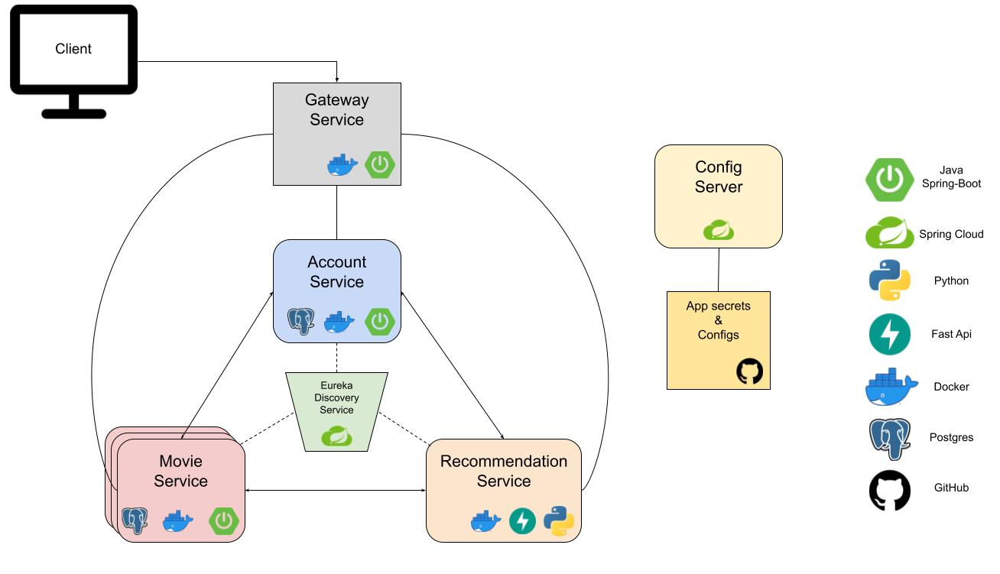

# fleam-backend
Backend of fleam video streaming platform.

Microservice architectured design:





## service ports

```
config-server       8888
discover-server     8761
gateway-service     8080
account-service     8081
movie-service       8082
recommendation      8083
postgres            5432
```


## execution

```bash
# first build the jars
./build_services.sh all

# then docker-compose
docker-compose up -d 

# wait for a few seconds for all services are up and live
```

endpoints documented in the postman json [file](./fleam-deploy-gateway.postman_collection.json)
